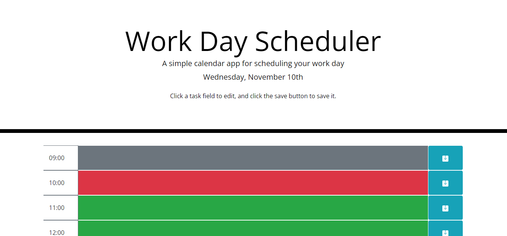
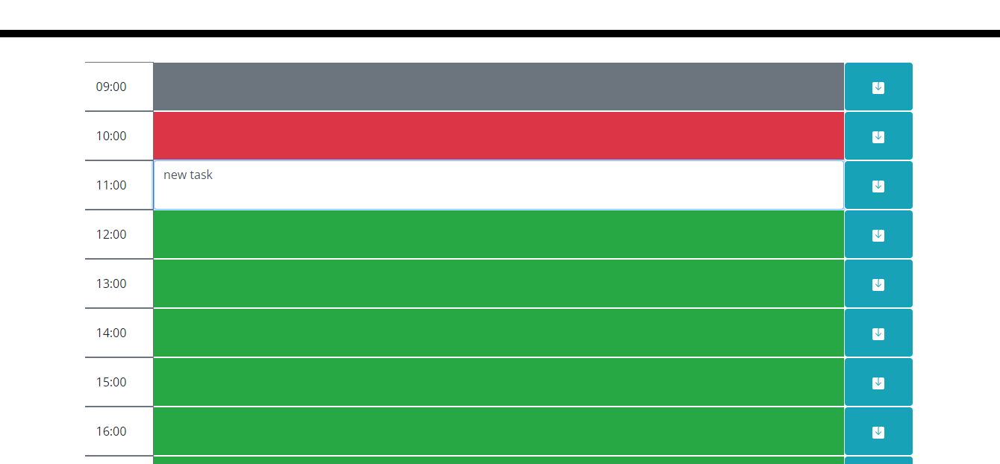
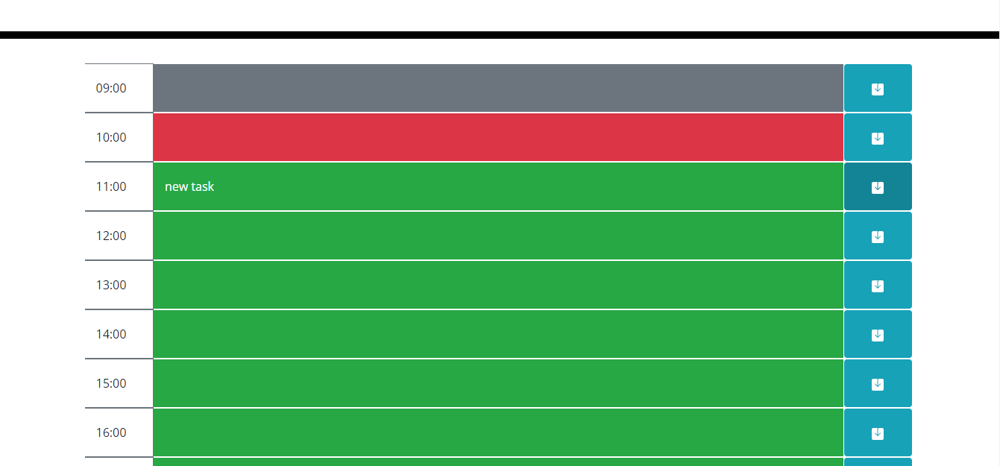
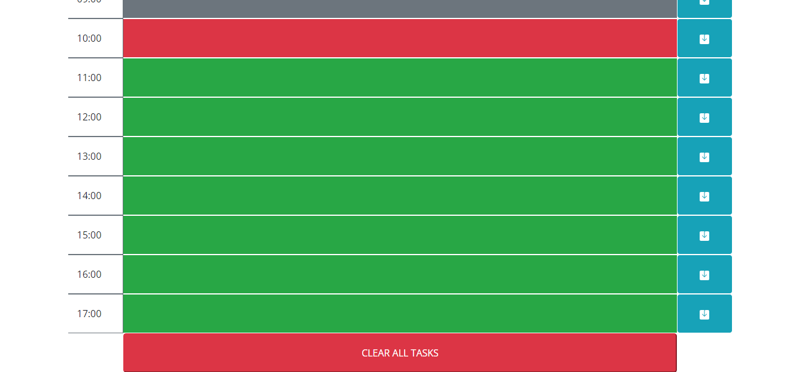

# Work Day Scheduler
Work Day Scheduler is an app meant to help an employee organize their daily tasks by the hour.

## Description
The landing page of Work Day Scheduler will display the current day, as well as a brief instructional sentence on how to use it. The color of the task field indicates its status: grey = that hour has passed, red = current hour, green = future hours.

## Using Work Day Scheduler
* A task can be edited by clicking on the colored box next to its time, which will turn that box into an editable field.

* The task is then saved by clicking the save button to the right of that task, which will also reapply the appropriate background color. This task is then saved in localStorage for persistence even if the window is closed.

* All tasks can be cleared at once by clicking the "CLEAR ALL TASKS" button at the bottom of the page. This clears every task field and the localStorage array for them.

Deployed application link: https://spaghettimedic.github.io/workDayScheduler/